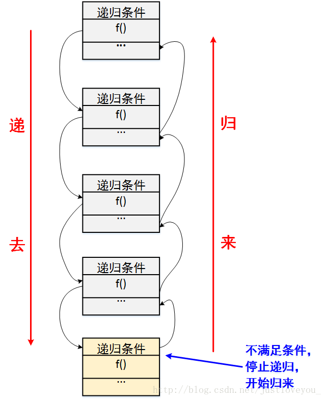
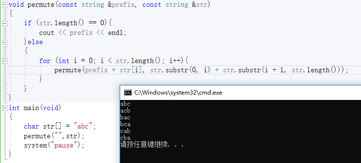
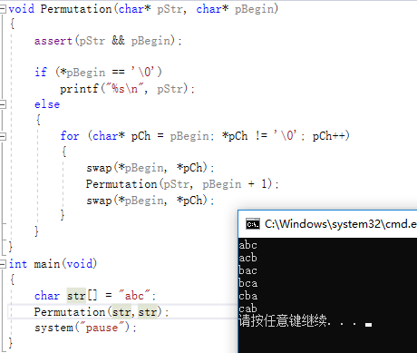

# 要点-递归 recursive algorithm

“To Iterate is Human, to Recurse, Divine.”中文译为：“人理解迭代，神理解递归。” - 游神，你会不会？惭愧不惭愧？

## 什么是递归呢

在数学与计算机科学中，递归(Recursion)是指在函数的定义中使用函数自身的方法。实际上，递归，顾名思义，其包含了两个意思：**递** 和 **归**，这正是递归思想的精华所在。


## 递归的精髓(思想)是什么

递归就是**有去（递去）有回（归来）**，如下图所示。

“**有去**”是指：递归问题必须可以分解为若干个规模较小，与原问题形式相同的子问题，这些子问题可以用相同的解题思路来解决，就像上面例子中的钥匙可以打开后面所有门上的锁一样；

“**有回**”是指 : 这些问题的演化过程是一个从大到小，由近及远的过程，并且会有一个明确的终点(临界点)，一旦到达了这个临界点，就不用再往更小、更远的地方走下去。最后，从这个临界点开始，原路返回到原点，原问题解决。　



更直接地说，递归的基本思想就是把规模大的问题转化为规模小的相似的子问题来解决。特别地，在函数实现时，因为解决大问题的方法和解决小问题的方法往往是同一个方法，所以就产生了函数调用它自身的情况，这也正是递归的定义所在。**格外重要的是，这个解决问题的函数必须有明确的结束条件，否则就会导致无限递归的情况。**

## 用归纳法来理解递归

数学都不差的我们，第一反应就是递归在数学上的模型是什么，毕竟我们对于问题进行数学建模比起代码建模拿手多了。观察递归，我们会发现，递归的数学模型其实就是 数学归纳法，这个在高中的数列里面是最常用的了，下面回忆一下数学归纳法。

数学归纳法适用于将解决的原问题转化为解决它的子问题，而它的子问题又变成子问题的子问题，而且我们发现这些问题其实都是一个模型，也就是说存在相同的逻辑归纳处理项。当然有一个是例外的，也就是归纳结束的那一个处理方法不适用于我们的归纳处理项，当然也不能适用，否则我们就无穷归纳了。总的来说，归纳法主要包含以下三个关键要素：

* 步进表达式：问题蜕变成子问题的表达式
* 结束条件：什么时候可以不再使用步进表达式
* 直接求解表达式：在结束条件下能够直接计算返回值的表达式

事实上，这也正是某些数学中的数列问题在利用编程的方式去解决时可以使用递归的原因，比如著名的斐波那契数列问题。


## 递归的三要素

在我们了解了递归的基本思想及其数学模型之后，我们如何才能写出一个漂亮的递归程序呢？笔者认为主要是把握好如下三个方面：

* 明确递归终止条件；
* 给出递归终止时的处理办法；
* 提取重复的逻辑，缩小问题规模。

1). 明确递归终止条件
```
　　 我们知道，递归就是有去有回，既然这样，那么必然应该有一个明确的临界点，程序一旦到达了这个临界点，就不用继续往下递去而是开始实实在在的归来。换句话说，该临界点就是一种简单情境，可以防止无限递归。
```
2). 给出递归终止时的处理办法
```
　　 我们刚刚说到，在递归的临界点存在一种简单情境，在这种简单情境下，我们应该直接给出问题的解决方案。一般地，在这种情境下，问题的解决方案是直观的、容易的。
```
3). 提取重复的逻辑，缩小问题规模*
```
　　 我们在阐述递归思想内涵时谈到，递归问题必须可以分解为若干个规模较小、与原问题形式相同的子问题，这些子问题可以用相同的解题思路来解决。从程序实现的角度而言，我们需要抽象出一个干净利落的重复的逻辑，以便使用相同的方式解决子问题。
```


## 递归和循环的区别是什么


```
递归：你打开面前这扇门，看到屋里面还有一扇门（这门可能跟前面打开的门一样大小（静），也可能门小了些（动）），你走过去，发现手中的钥匙还可以打开它，你推开门，发现里面还有一扇门，你继续打开，。。。， 若干次之后，你打开面前一扇门，发现只有一间屋子，没有门了。 你开始原路返回，每走回一间屋子，你数一次，走到入口的时候，你可以回答出你到底用这钥匙开了几扇门。
```

```
循环：你打开面前这扇门，看到屋里面还有一扇门，（这门可能跟前面打开的门一样大小（静），也可能门小了些（动）），你走过去，发现手中的钥匙还可以打开它，你推开门，发现里面还有一扇门，（前面门如果一样，这门也是一样，第二扇门如果相比第一扇门变小了，这扇门也比第二扇门变小了（动静如一，要么没有变化，要么同样的变化）），你继续打开这扇门，。。。，一直这样走下去。 入口处的人始终等不到你回去告诉他答案。
```
```
递归是静中有动，有去有回。
循环是动静如一，有去无回。
```

递归与循环是两种不同的解决问题的典型思路。递归通常很直白地描述了一个问题的求解过程，因此也是最容易被想到解决方式。循环其实和递归具有相同的特性，即做重复任务，但有时使用循环的算法并不会那么清晰地描述解决问题步骤。单从算法设计上看，递归和循环并无优劣之别。然而，在实际开发中，因为函数调用的开销，递归常常会带来性能问题，特别是在求解规模不确定的情况下；而循环因为没有函数调用开销，所以效率会比递归高。递归求解方式和循环求解方式往往可以互换，也就是说，如果用到递归的地方可以很方便使用循环替换，而不影响程序的阅读，那么替换成循环往往是好的。问题的递归实现转换成非递归实现一般需要两步工作：

(1). 自己建立“堆栈(一些局部变量)”来保存这些内容以便代替系统栈，比如树的三种非递归遍历方式；

(2). 把对递归的调用转变为对循环处理。

特别地，在下文中我们将给出递归算法的一些经典应用案例，对于这些案例的实现，我们一般会给出递归和非递归两种解决方案，以便读者体会。

## 递归的应用场景

在我们实际学习工作中，递归算法一般用于解决三类问题：

1. 问题的定义是按递归定义的（Fibonacci函数，阶乘，…）；
2. 问题的解法是递归的（有些问题只能使用递归方法来解决，例如，汉诺塔问题，…）；
3. 数据结构是递归的（链表、树等的操作，包括树的遍历，树的深度，…）。

在下文我们将给出递归算法的一些经典应用案例，这些案例基本都属于第三种类型问题的范畴。

## 递归算法的编程模型

在我们明确递归算法设计三要素后，接下来就需要着手开始编写具体的算法了。在编写算法时，不失一般性，我们给出两种典型的递归算法设计模型，如下所示

* 模型一： 在**递去**的过程中解决问题

```
function recursion(大规模){
    if (end_condition){      // 明确的递归终止条件
        end;   // 简单情景
    }else{            
        // 在将问题转换为子问题的每一步，解决该步中剩余部分的问题
        solve;                // 递去
        recursion(小规模);     // 递到最深处后，不断地归来
    }
}
```

* 模型二： 在**归来**的过程中解决问题

```
function recursion(大规模){
    if (end_condition){      // 明确的递归终止条件
        end;   // 简单情景
    }else{            
      // 先将问题全部描述展开，再由尽头“返回”依次解决每步中剩余部分的问题
        recursion(小规模);     // 递去
        solve;                // 归来
    }
}
```

* 模型三： **嵌套循环**的过程中解决问题

```
function recursion(大规模){
    if (end_condition){      // 明确的递归终止条件
        end;   // 递归结束条件
    }else{            
        // 先将问题全部描述展开，再由尽头“返回”依次解决每步中剩余部分的问题
        for () {
          recursion(小规模);     // 递去
          solve;                // 归来
        }
    }
}
```

* 这里，每次递归进去可以发现不同的子递归入门口，而不是每次都说老老实实一个递归入口，而且递归入口数量还是动态的。你到下一个递归可能还要进行一次多个递归入口遍历执行。
*  在将问题转换为子问题描述的每一步，都解决该步中剩余部分的问题。


## 模型一-去递归

```
function recursion(大规模){
    if (end_condition){      // 明确的递归终止条件
        end;   // 简单情景
    }else{            
        // 在将问题转换为子问题的每一步，解决该步中剩余部分的问题
        solve;                // 递去
        recursion(小规模);     // 递到最深处后，不断地归来
    }
}
```
* 实例一:
```
二叉树中从每个叶子结点到根结点的路径
```

很明显，每到一个分支就要存放对应的节点，走到叶子节点把存放的节点全都打印一遍，然后回退到另一个分支

```
void PrintAllPath(BiTree T, char path[], int pathlen)
{
  int i;
  if(T != NULL) {
    path[pathlen] = T->data; //将当前结点放入路径中
    if(T->lchild == NULL && T->rchild == NULL) {//叶子结点
        for(i = pathlen; i >= 0; i--)
            cout << path[i] << " " ;
      cout << endl;
    }else{
      PrintAllPath(T->lchild, path, pathlen + 1);
      PrintAllPath(T->rchild, path, pathlen + 1);
    }
  }
}
```

* 实例二:
```
构造函数，使用递归算法进行左右结点转换
```
从上到下，没经过一层就要变换左右，很明显是在去递归过程中完成的。
```
void ExChangeTree(BiTree &T)
{
    BiTree temp;
    if(T!=NULL){//判断T是否为空，非空进行转换，否则不转换
        temp=T->lchild;
        T->lchild=T->rchild;//直接交换节点地址
        T->rchild=temp;
        ExChangeTree(T->lchild);
        ExChangeTree(T->rchild);
    }
}
```

## 模型二-回递归

```
function recursion(大规模){
    if (end_condition){      // 明确的递归终止条件
        end;   // 简单情景
    }else{            
      // 先将问题全部描述展开，再由尽头“返回”依次解决每步中剩余部分的问题
        recursion(小规模);     // 递去
        solve;                // 归来
    }
}
```

* 实例一:
```
阶乘  n! = n * (n-1) * (n-2) * ...* 1(n>0)
```

```
int recursive(int i)
{
	if (0 == i)
		return (1);
	else
		return i * recursive(i-1);
}
```

* 实例二:

```
斐波那契 递归的方法定义：F(1)=1，F(2)=1, F(n)=F(n-1)+F(n-2)（n>=2，n∈N*）递归的方法定义：F(1)=1，F(2)=1, F(n)=F(n-1)+F(n-2)（n>=2，n∈N*）
```
```
long Fib(int n)
{
 if (n == 0)
    return 0;
 if (n == 1)
    return 1;
 if (n > 1)
    return Fib(n-1) + Fib(n-2);
}
```

* 实例三:
```
统计二叉树中结点的个数
```

```
int NodeCount(BiTree T)
{
    if(T==NULL)
      return 0;
    else
      return NodeCount(T->lchild)+NodeCount(T->rchild)+1;
}
```
* 实例四:
```
统计二叉树中叶子结点的个数
```

```
int LeafCount(BiTree T)
{
    if(!T)
      return 0;
    if(!T->lchild &&!T->rchild){//如果二叉树左子树和右子树皆为空,说明该二叉树根节点为叶子节点,加1.
        return 1;
    }else{
        return LeafCount(T->lchild)+LeafCount(T->rchild);
    }
}
```


## 模型三-嵌套循环递归

把我理解到递归思想把递归用程序表达出来，确定了三个要素：**递 + 结束条件 + 归。**

总结到这里，我突然发现递归是为了最能表达这种思想，所以用“递归”这个词，其实递归可以是**“有去有回”**，也可以是“有去无回”。但其根本是**“由大往小地去，由近及远地去”**。“递”是必需，“归”并非必需，依赖于要解决的问题，**有的需要去的路上解决，有的需要回来的路上解决。**有递无归的递归其实就是我们很容易理解的一种分治思想。

其实理解递归可能没有“归”，只有去（分治）的情况后，我们应该想到**递归也许可以既不需要在“去”的路上解决问题，也不需要在“归”的路上解决问题，只需在路的尽头解决问题，即在满足停止条件时解决问题。**递归的分治思想不一定是要把问题规模递归到最小，还可以是将问题递归穷举其所有的情形，这时通常递归的表达力体现在将无法书写的嵌套循环（不确定数量的嵌套循环）通过递归表达出来。

将这种递归情形用递归程序描述如下：

```
recursion()
{
     if (end_condition) //结束条件
     {
          solve;    //结束的时候解决问题   
     }
     else
     {     //在将问题转换为子问题描述的每一步，都解决该步中剩余部分的问题。
          for () {    
            recursion();     //go;
          }
     }
}
```
例如，字符串的全排列就可以用这种递归简洁地表达出来，如下
```
void permute(const string &prefix, const string &str)
{
    if(str.length() == 0)
        cout << prefix << endl;
    else
    {   
        for(int i = 0; i < str.length(); i++)
            permute(prefix+str[i], str.substr(0,i)+str.substr(i+1,str.length()));
    }   
}
```



```
void Permutation(char* pStr, char* pBegin)
{
	assert(pStr && pBegin);

	if (*pBegin == '\0')
		printf("%s\n", pStr);
	else
	{
		for (char* pCh = pBegin; *pCh != '\0'; pCh++)
		{
			swap(*pBegin, *pCh);
			Permutation(pStr, pBegin + 1);
			swap(*pBegin, *pCh);
		}
	}
}
```


对递归的理解就暂时到这里了，可以看出文章中提到关于“打开一扇门”的递归例子来解释递归并不准确，例子只描述了递归的一种情况。而“递归就是有去（递去）有回（归来）”的论断同样不够准确。要为只读了文章前半部分的读者惋惜了。我也给出自己对递归思想的总结吧：


## 总结

* 递归必须有去有回，必须有入口出口，要解决的问题要么在去的过程中解决，要么在回来中得过程解决，要么在尽头解决

```
递归的基本思想是广义地把规模大的问题转化为规模小的相似的子问题或者相似的子问题集合来解决。广义针对规模的，规模的缩小具体可以是指递归函数的参数，也可以是其参数之一。相似是指解决大问题的方法和解决小问题的方法往往是同一个方法，还可以是指解决子问题集的各子问题的方法是同一个方法。解决大问题的方法可以是由解决次规模问题的方法和解决剩余部分的方法组成，也可以是由一系列解决次规模问题的方法组成。
```


## 参考博客

* <https://www.jianshu.com/p/4db970d8ddc1>
* <http://www.nowamagic.net/librarys/veda/detail/2314>

## END
